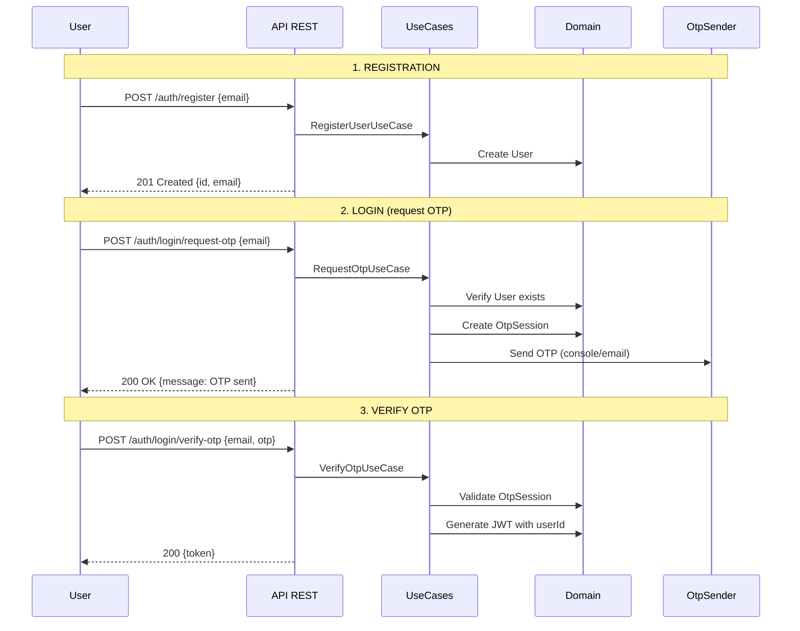
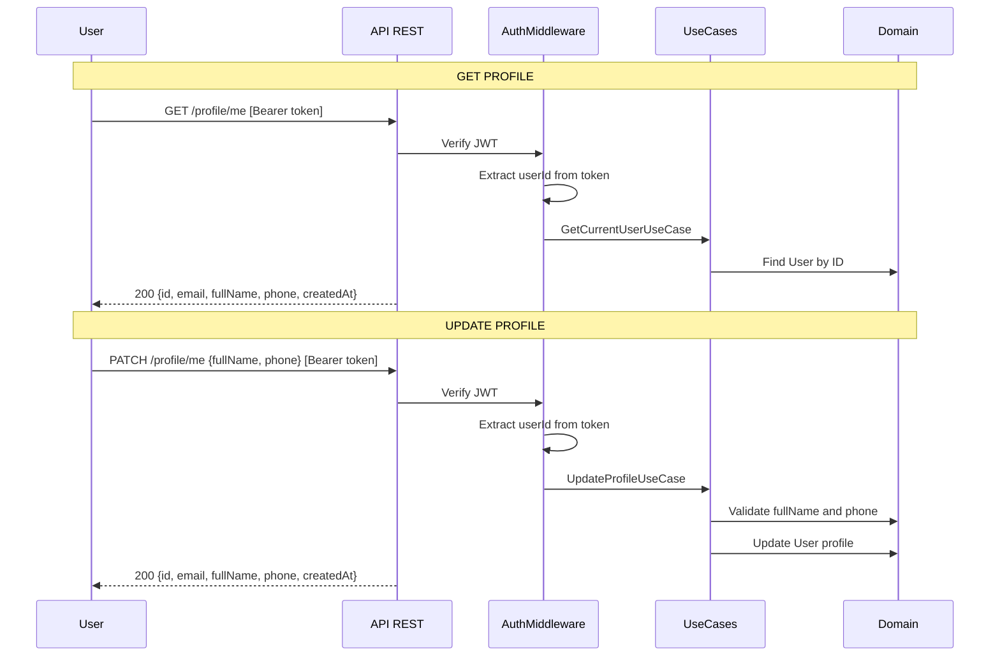

# Authentication Flow

## Registration and OTP-based Login



## Protected Endpoints (Profile)



## Endpoints

| Method | Endpoint | Auth | Description |
|--------|----------|------|-------------|
| POST | `/auth/register` | No | Register new user with email |
| POST | `/auth/login/request-otp` | No | Request OTP code sent to console |
| POST | `/auth/login/verify-otp` | No | Verify OTP code and receive JWT token |
| GET | `/profile/me` | JWT | Get current user profile |
| PATCH | `/profile/me` | JWT | Update user fullName and phone |

## OTP Code

- 6-digit numeric code
- Valid for 5 minutes after generation
- Single use (deleted after successful verification)
- Max 3 failed attempts before blocking

## JWT Token

- Contains `userId` in payload
- Default expiration: 24 hours
- Algorithm: HS256

## Profile Fields

| Field | Type | Validation |
|-------|------|------------|
| `fullName` | string | Required, not empty |
| `phone` | string | International format (+34612345678) or empty |

## Request/Response Examples

### Register User
```bash
POST /auth/register
Content-Type: application/json

{"email": "user@example.com"}
```

Response 201:
```json
{
  "id": "uuid",
  "email": "user@example.com",
  "fullName": "",
  "phone": "",
  "createdAt": "2024-01-01T00:00:00.000Z"
}
```

### Request OTP
```bash
POST /auth/login/request-otp
Content-Type: application/json

{"email": "user@example.com"}
```

Response 200:
```json
{"message": "OTP sent"}
```

### Verify OTP
```bash
POST /auth/login/verify-otp
Content-Type: application/json

{"email": "user@example.com", "otp": "123456"}
```

Response 200:
```json
{"token": "eyJhbGciOiJIUzI1NiIsInR5cCI6IkpXVCJ9..."}
```

### Get Profile
```bash
GET /profile/me
Authorization: Bearer <token>
```

Response 200:
```json
{
  "id": "uuid",
  "email": "user@example.com",
  "fullName": "John Doe",
  "phone": "+34612345678",
  "createdAt": "2024-01-01T00:00:00.000Z"
}
```

### Update Profile
```bash
PATCH /profile/me
Authorization: Bearer <token>
Content-Type: application/json

{"fullName": "John Doe", "phone": "+34612345678"}
```

Response 200:
```json
{
  "id": "uuid",
  "email": "user@example.com",
  "fullName": "John Doe",
  "phone": "+34612345678",
  "createdAt": "2024-01-01T00:00:00.000Z"
}
```

## Error Responses

| Status | Type | Example |
|--------|------|---------|
| 400 | Bad Request | Missing required fields |
| 401 | Unauthorized | Invalid/missing token, invalid OTP |
| 404 | Not Found | User not found, no OTP session |
| 409 | Conflict | Email already registered |
| 422 | Validation Error | Invalid email/phone format, empty fullName |
| 429 | Too Many Requests | Account blocked after 3 failed OTP attempts |

## Interactive API Documentation

Swagger UI is available at: **http://localhost:8080/api-docs**

Start the server and navigate to the URL to explore and test the API interactively.

## Viewing Mermaid Diagrams

This documentation includes Mermaid diagrams that render automatically on GitHub/GitLab.

### In Cursor/VS Code

1. Install the extension **Markdown Preview Mermaid Support** (`bierner.markdown-mermaid`)
2. Open any `.md` file
3. Press `Cmd + Shift + V` (Mac) or `Ctrl + Shift + V` (Windows/Linux) to open preview
4. Or use `Cmd + K V` to open preview in a side panel
